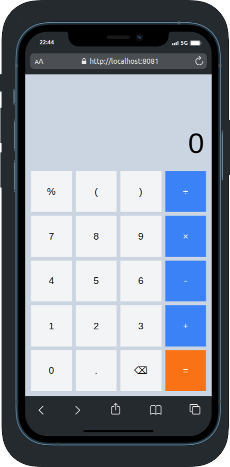

# Calculadora Simples com React Native e NativeWind

## Descrição

Este projeto é uma calculadora simples desenvolvida com **React Native** e estilizada utilizando **NativeWind** (integração do Tailwind CSS com React Native). A calculadora realiza operações matemáticas básicas como soma, subtração, multiplicação e divisão.

## Funcionalidades

- Interface moderna e responsiva com NativeWind.
- Operações matemáticas básicas (`+`, `-`, `*`, `/`).
- Exibição do cálculo em tempo real no display.

## Tecnologias

- React Native
- NativeWind (Tailwind CSS)
- Expo
